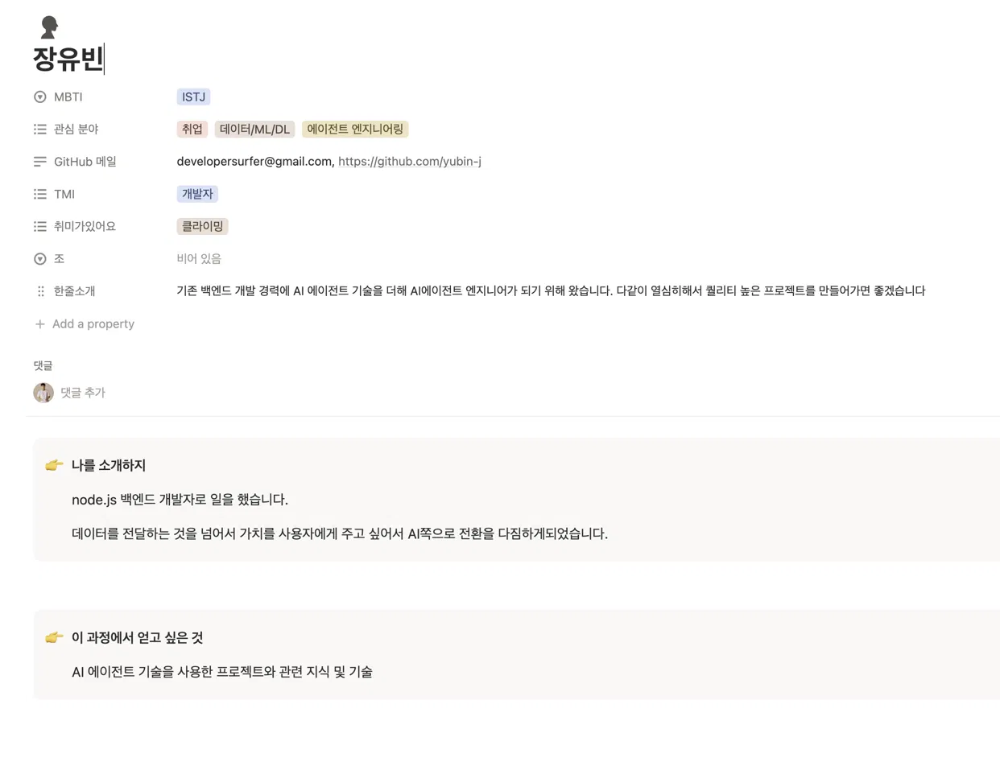

# 장유빈님 강점 찾기 커리어 코칭 대화

## 프로필 이미지


## 최초 메시지 (요청 프롬프트)

```
너는 나의 강점을 찾아주는 커리어 코치야.
첨부한 이미지는 내 자기소개 페이지야. 먼저 이걸 읽고 나를 파악해줘.

나는 아직 내 강점이 뭔지 잘 모르겠어.
그러니 지금부터 나에게 한 번에 하나씩 질문을 던져줘.
내가 대답하면, 그 대답을 바탕으로 다음 질문을 이어가.
(내 대답을 안 듣고 미리 강점을 말하지 마.)

질문은 첨부한 내 소개(관심분야, 취미, TMI)에서 힌트를 얻어서,
"내가 시간 가는 줄 모르고 몰입한 순간",
"남들은 어려워하는데 나는 쉬웠던 일",
"주변에서 나에게 자주 부탁하거나 칭찬하는 것" 같은
경험을 끌어내는 질문으로 해줘.

먼저 첨부 이미지를 보고 나를 한 줄로 요약한 뒤,
첫 번째 질문 하나만 던져줘.
```

---

## 대화 내용

**코치 (한 줄 요약)**
> node.js 백엔드로 데이터를 다뤄오다가, 이제는 사용자에게 직접 가치를 전달하고 싶어서 AI 에이전트 쪽으로 방향을 트는, 클라이밍을 즐기는 ISTJ 개발자시네요.

**질문 1**
> 클라이밍을 하다 보면 어떤 루트는 유난히 몰입해서, 시간 가는 줄 모르고 계속 시도하게 되는 순간이 있잖아요.
>
> 개발 업무(혹은 코드) 중에서도 그런 "루트"처럼, 막혔는데도 짜증나기보다 오히려 재밌어서 계속 붙잡고 있었던 문제나 순간이 있었나요? 구체적으로 어떤 상황이었는지 말씀해주세요.

**답변 1**
> 오.. 맞아 그런 비슷한 순간이 많이 있어요
>
> 출퇴근이 자유로운 문화인 회사에서 어떠한 문제가 나를 괴롭힐 때 이를 내가 알고 있거나 몰랐더라도 새로운 기술을 습득해서 적용하여 해결할 때 퇴근시간이 지났지만 조금만 더 하면 해결할 수 있을것 같아서 퇴근도 미루면서 문제를 해결한 적이 있어요
>
> 그런데 사실 이건 결과론적으로 잘 풀려나가는 느낌이 있어서 재밌다고 느껴지는거긴 한데요.
> 반대로 잘 안풀리는 문제라도 결국에는 풀려나가기 때문에 끝에 다다라서는 뿌듯함과 성취감이 느껴지죠.
> 짜증나고 힘들었던 순간들이 있었지만 이는 잊혀지고요.
>
> 가장 큰 문제는 결국 해결방법을 못 찾는 경우인데.. 이는 어쩔 수 없는거 같아요 그런 경우에는 동료들과 얘기해서 다른 방향으로 틀거나 우선순위를 따져서 그냥 넘어가죠.. 어쩔 수 없는 부분이라서 빨리 그때의 감정을 잊으려고 하는편이에요

**질문 2**
> 같이 일하던 동료들이 "이거 어렵다, 못 하겠다"고 하는 문제인데, 유빈님한테는 의외로 어렵지 않게 느껴졌던 경험이 있나요?
>
> (꼭 거창한 기술 문제가 아니어도 괜찮아요. "다들 헷갈려하는데 나는 그냥 딱 보였다" 같은 것도 좋고, 새로운 기술을 습득하는 속도나 방식에서 남들과 달랐던 부분이어도 좋아요.)

**답변 2**
> 많이는 아니지만 종종 경험했었어요..
> 회사에서의 주변 동료들은 대부분 잘 하기 때문에 빈도 수 자체가 낮죠..
> 그리고 한번에 다가오지 않는 경우가 있긴한데 그럴 때는 같이 대화를 하면서 고민을 하다보면 풀리는 때가 있더라고요

**질문 3**
> 동료들이 유빈님한테 유독 자주 물어보거나, 부탁하거나, "이건 유빈님한테 물어보면 되겠다" 하고 찾아오는 종류의 일이 있나요?
>
> (예: 특정 기술 이슈, 디버깅, 새로운 기술 조사, 일정/우선순위 정리, 갈등 조율 등 — 뭐든 괜찮아요. 그리고 그럴 때 동료들이 유빈님한테 뭐라고 칭찬하거나 표현하는지도 같이 말씀해주시면 좋겠어요.)

**답변 3**
> 음.. 제가 개발한 부분에서 문제가 있거나 아니면 연관된 기능이라면 저에게 와서 업무를 해달라고 하죠..
> 제가 가장 최근에 작업했으니 제가 잘 아는 거니까요
>
> 칭찬같은건 안하지만 부탁을 했었던 거 같은데요?
> 근데 뭐 어짜피 해야 하는거라서 당연히 받아서 했었고요

**질문 4**
> 소개 글에 보니 "데이터를 전달하는 것을 넘어서 가치를 사용자에게 주고 싶어서 AI 쪽으로 전환을 다짐하게 됐다"고 쓰셨더라고요.
>
> 혹시 이런 마음이 든 계기가 있었나요? 예를 들어 백엔드 작업을 하다가 "이건 결국 누가 쓰는 거지?", "이게 진짜 사용자한테 어떤 의미가 있지?" 같은 생각이 들었던 구체적인 순간이나 프로젝트가 있었는지 궁금해요.

**답변 4**
> 가장 큰 계기는 메뉴 카테고리 추천을 시간대별로 하는 게 있었는데 이를 데이터 기반이 아닌 사장님의 임의의 감으로 하드코딩하듯이 들어간 적이 있습니다..
> 이 때 가장 큰 괴리를 느꼈죠..

**질문 5**
> 그 순간에 유빈님은 구체적으로 어떤 생각이나 감정이 들었나요?
>
> 예를 들면,
> - "내가 만든 시스템이 무의미하게 쓰이는구나" 같은 답답함이었는지
> - "이건 내가 데이터로 더 잘 풀 수 있을 것 같은데" 같은 아이디어/의욕이었는지
> - 아니면 그 자리에서 뭔가 제안하거나 시도해본 게 있었는지
>
> 그때 느낀 감정과, 그 이후에 실제로 뭔가 행동으로 옮긴 게 있었다면 같이 말씀해주세요.

**답변 5**
> 그 때 데이터를 이용할 수 있는 지식이나 기술이 있었다면 이를 어필해서 기획방향을 바꿀 수 있지 않을까라는 생각이 들었죠
> 그런데 어떻게 할 수 있는지 모르니까 그냥 어이없었지만 그냥 그렇게 만들고 말았어요..

**질문 6**
> 그 "괴리감"을 느낀 이후부터 지금 AI 에이전트 기술을 공부하기로 결심하기까지, 그 사이에 어떤 과정이 있었나요?
>
> 예를 들어 혼자 독학을 시작했다거나, 특정 계기(강의, 아티클, 사람)가 있었다거나, 아니면 "이번엔 절대 모른다고 넘어가지 말자"는 식의 결심이 있었다거나요. 그때 스스로 어떤 방식으로 새로운 걸 익혀나갔는지도 궁금해요 (예: 일단 만들어보면서 배운다 / 이론부터 탄탄히 잡는다 / 커뮤니티나 사람들과 얘기하며 배운다 등).

**답변 6**
> 흠.. 방통대에서 머신러닝/딥러닝 수업을 수강했고 현재는 빅데이터학과 특수대학원에 다니는 중입니다.
> 그런데도 아직 이 지식들을 기술로 직접 구현한 경험은 없네요..
>
> 이제 이를 바꿔보고자 그 때의 기획과 관련된 기술은 아니지만 AI 에이전트 엔지니어 부트캠프 과정을 시작했습니다.
> 여기서 RAG, Langchain, Langgraph, MCP, A2A를 배워서 제가 원하는 목표인 사용자에게 가치를 주는 AI 에이전트 엔지니어가 되고자 해요

---

## 강점 정리 (1차, 5가지)

1. **괴리감을 참지 않고, 결국 방법을 찾아가는 사람** — 하드코딩된 추천 시스템에 느낀 괴리감을, 방통대 → 대학원 → 부트캠프로 이어지는 장기적 학습으로 실제로 메워가는 지속력
2. **몰입해서 끝까지 파고드는 근성 + 실용적인 손절 능력의 균형** — 퇴근을 미룰 만큼 몰입하면서도, 안 풀리면 동료와 상의해 방향을 트는 유연함
3. **내가 만든 것에 대한 책임감(오너십)** — 본인이 개발한 부분에 대한 요청을 당연하게 받아들이는 태도
4. **혼자보다 대화 속에서 답을 찾는 협업형 문제해결자**
5. **가치 지향적 동기 — 기술 자체보다 '누구에게 어떤 의미가 있는가'를 먼저 본다**

**유빈님 피드백**
> 1,2,3 은 확실히 나의 성향이 맞아요
> 4,5 번은 그러한 상황이 오면 하는 것 같긴한데 그렇다고 완전히 저의 모습과 부합한다고는 제가 스스로 말하기가 힘드네요
> 그 확언은 제가 책임지기에는 좀 부담스러워서요.

---

## 최종 강점 3가지 (확정)

### 1. 모르는 것도 직접 학습해서 해결하는 실행력
**근거**: "새로운 기술을 습득해서 적용하여 해결할 때, 퇴근시간이 지났지만 조금만 더 하면 해결할 수 있을 것 같아서 퇴근도 미루면서 문제를 해결한 적이 있다"

- "필요한 기술을 그때그때 학습하여 문제를 끝까지 해결하는 실행력"
- "모르는 기술도 빠르게 습득해 실제 문제 해결에 적용한 경험 다수"
- (자소서/포트폴리오용) "OO 문제 해결을 위해 [기술명]을 새롭게 학습하여 적용, 서비스에 반영함"

### 2. 완벽주의가 아닌, 실용적 판단에 기반한 끈기
**근거**: "안 풀리는 문제라도 결국에는 풀려나가기 때문에 뿌듯함을 느낀다. 해결방법을 못 찾는 경우엔 동료들과 얘기해서 다른 방향으로 틀거나 우선순위를 따져서 넘어간다"

- "문제 해결과 우선순위 조정 사이의 균형 감각"
- "무한정 매달리기보다 팀 논의를 통해 방향 전환을 판단하는 실용적 문제해결력"
- (면접용) "해결이 어려운 이슈는 팀과 논의해 우선순위를 재조정하며 프로젝트 진행 속도를 유지한 경험"

### 3. 본인이 만든 결과물에 대한 오너십
**근거**: "제가 개발한 부분에서 문제가 있거나 연관된 기능이면 저에게 업무를 해달라고 한다... 어차피 해야 하는 거라서 당연히 받아서 했다"

- "본인이 개발한 기능에 대한 지속적인 책임감과 오너십"
- "담당 기능의 유지보수 및 관련 이슈 대응을 전담해온 경험"
- (자소서용) "개발한 기능에 대해 동료들의 신뢰를 바탕으로 관련 이슈 해결을 지속적으로 담당함"

**핵심 요약**: 이 세 가지는 "혼자서도 끝까지 해내지만, 무모하게 밀어붙이지 않고, 자기 책임을 다하는 사람"이라는 하나의 축으로 연결됨.