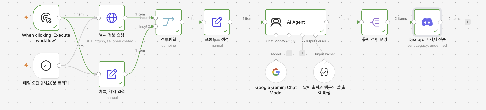

# Day 5

## 디스코드

디스코드는 채팅앱이지만 알림을 줄 수 있는 API를 제공한다.

자동화 시 이 API를 활용하여 사람들에게 알림을 주는 용도로 사용 가능

## 조별 게임 시연

조별로 각자의 게임을 다시 해보고 대표 게임을 선발해서 소개 후 시연

서비스 개발 -> 시연/재연 -> 버그나 개선사항 발견 -> 수정 반영 -> 반복

## 배포 환경

서버를 개발할 때는 로컬에서 실행하면 되지만 서비스화하면 항상 돌아가는 시스템에서 동작해야 한다.

그래서 cloud상에 올린다 -> aws, gcp 돈을 내고 임대

사용자는 어떻게 우리의 서버에 접속할 수 있는가 -> 도메인 이름을 통해 접속

도메인 구입 방법과 도메인 주소의 구조

## 인터넷 연결과 DNS

전세계 인터넷 연결

 - 해저 데이터 전송 케이블 -> 유선
 - 스타링크 -> 무선 인공위성 통신

도메인 원리

주소 입력 -> DNS를 통해 ip 주소 획득 -> ip주소로 요청 -> 데이터 응답

## 노코드 n8n

edit fields를 활용하여 데이터 가공

디스코드 연동하여 메일보내기

제미나이 연동해서 챗봇 답변 추출하기

## n8n을 이용한 과제 진행

ai agent 노드 연결

데이터를 split해서 출력된 데이터가 여러개일 때, 다음 노드에서는 각각의 데이터에 대해서 데이터 수만큼 동작

http get 노드를 이용해 날씨 데이터를 받아오고, 이를 프롬프트에 적용해 ai에게 질의, 응답을 디스코드를 통해 전송

-> 자동화의 시작

