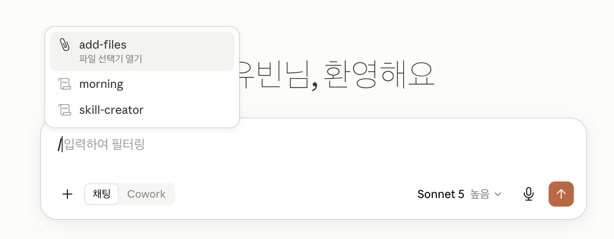

# Day 8

## 환경변수

환경변수 설명 - prd, dev, stg

환경변수 url 관련해서 추가 설명

## AI와 함께하는 디자인

벤치마킹 식, 완전 새로운 디자인

핀터레스트 참고

클로드 디자인 이용

## 클로드 코드 스킬

스킬을 이용가능

프롬프트로 스킬을 지정해달라고 함.

/를 붙여서 스킬이름 지정시 사용 가능

위의 경우 /레비오사 url

자연스럽게 대화에서도 가능

깃헙에서 스킬을 구할 수도 있음..

 - https://github.com/aidenlim-dev/AIOFFICE-SearchPro
 - https://github.com/epoko77-ai/im-not-ai

설치방법은 readme.md에 있거나 클로드에게 직접 설치하라고 지시할 수 있음

최근은 너무 많은 스킬을 사용하지 않고 깔끔하게 필요한 것만 사용.

## 토큰을 줄여주는 스킬

https://github.com/DietrichGebert/ponytail

토큰을 줄여주는 스킬은 큰 프로젝트일수록 효과가 별로인거 같다고 하심

## 실습

제미나이를 활용한 프로젝트로 기존 프로젝트에서 제미나이 추가
